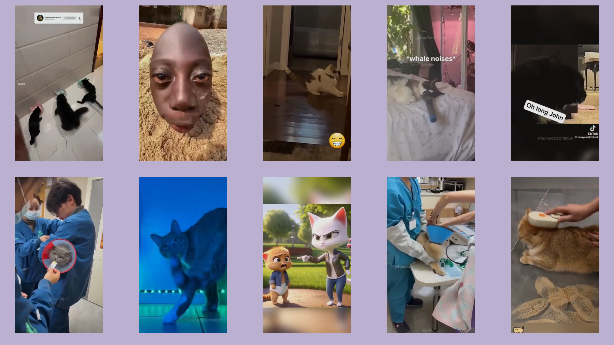

# ReelsMaxing
## Inspiration
Many of us these days love doom-scrolling through TikTok, Instagram Reels, and YouTube Shorts to destress or engage in revenge bedtime procrastination. However, on mobile devices, using a portrait view limits viewers to watching one video at a time. Even on laptops, all our beloved platforms only render one video at a time.

In today's hectic schedules, where time to unwind is limited, we decided to maximize the use of laptop screen real estate (and, to some extent, tablets and televisions) to make the brainrot experience 10x more efficient.

## What it does
ReelsMaxing creates a 2x5 grid of short-form videos by observing popular YouTube streams and displaying them. It maximizes the screen real estate of laptops and most landscape devices, such as iPads and televisions, allowing you to be extremely productive with your brainrot endeavors.

## How we built it
We used Vite with React and TypeScript for our frontend to prioritize fast-paced development. TypeScript’s type safety ensured our code was mostly bug-free and easier to work with due to type hinting and IntelliSense. Material-UI provided clean and effective UI components. For our backend, we used Python Flask since our video searching and streaming APIs were based in Python. We used PyTubeFix to retrieve YouTube Shorts streams.

Version control was managed with Git and GitHub.

For optimization, we pre-computed and cached video stream URLs.

## Challenges we ran into
1. **Deciding on an idea:** Our team had many great ideas, but it took until 6 PM—after much debate—to finalize one. Additionally, we lost two team members during this period due to illness and other commitments.

2. **Carousel scroller implementation:** Achieving a carousel scroller similar to TikTok, Instagram Reels, and YouTube Shorts was difficult. Existing packages and tutorials were incompatible with our specific framework of Vite, TypeScript, and React. Ultimately, we coded our own solution based on simpler tutorials, which worked out well.

3. **Obtaining Shorts videos:** Finding a way to stream YouTube Shorts was challenging. Downloading videos was expensive and time-consuming. Through research, we discovered a method to get a streamable video URL using PyTubeFix. While stream URLs were temporary, this limitation aligned with our platform’s short-term viewing model.

4. **Optimization challenges:** Initially, fetching 10 reels took about 60 seconds. By parallelizing requests, we reduced this to 20 seconds. Still, this was too long for a seamless user experience. We implemented a caching mechanism on the server to preload stream URLs. While users watched preloaded reels, additional reels were dynamically loaded in the background, maintaining a surplus of content and minimizing downtime. However, this still proved to be inefficient and ultimately, we decided to resort to caching our streams for the purposes of our demo.

5. **Browser autoplay restrictions:** Modern browsers block autoplaying videos with sound unless triggered by user interaction. Simulating user interactions to bypass this restriction failed due to the "isTrusted" attribute in modern browsers. After exploring workarounds, we discovered that Microsoft Edge allowed autoplay with sound, solving the issue after hours of frustration. However, Google Chrome’s deprecated autoplay policy flags caused significant delays in finding a solution.

## Accomplishments that we're proud of
We successfully executed our idea despite facing numerous challenges. Overcoming technical hurdles, such as optimization and autoplay restrictions, was particularly rewarding.

## What we learned
- Gained insights into browser flags and attributes like "isTrusted" that enforce user interaction.
- Enhanced our knowledge of Vite, Material-UI, and Docker (as we considered Dockerizing our project).
- Learned about efficient content streaming and caching techniques to improve user experience.

## What's next for ReelsMaxing
- **UI improvements:** Refining the interface and adding a search feature to enable users to browse specific genres of content.
- **Browser compatibility:** Expanding support to more browsers like Google Chrome.
- **Mobile expansion:** Developing Android and iOS apps to bring ReelsMaxing to more users.
- **Smart glasses integration:** With advancements in smart glasses, we envision displaying more than 10 reels simultaneously for an immersive experience.
- **Improved loading speed:** Further optimizing stream fetching to enhance the seamless experience.
- **Multi-platform integration:** Adding Instagram Reels and TikTok to create a unified platform for brainrot enthusiasts.
- **Content grouping:** Implementing a feature to group videos with similar audio for a more cohesive viewing experience.

Here’s a rephrased version:  

## Technical Details  
- The application works best with Microsoft Edge when the following settings are enabled:  
  - **Cookies and Site Permissions**  
  - **Media Autoplay**: Set to "Allow" to control whether audio and video play automatically on sites.  
- Cached stream entries will expire on **19 January 2025, at 5:00 PM**.  